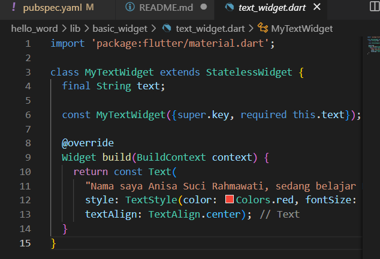
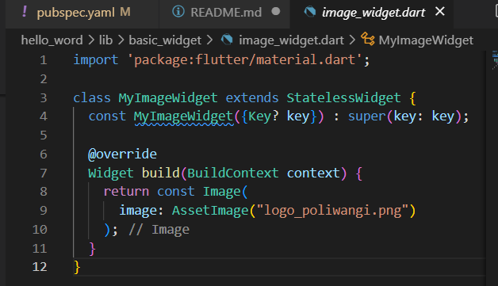

# hello_word

A new Flutter project.

## Getting Started

This project is a starting point for a Flutter application.

A few resources to get you started if this is your first Flutter project:

- [Lab: Write your first Flutter app](https://docs.flutter.dev/get-started/codelab)
- [Cookbook: Useful Flutter samples](https://docs.flutter.dev/cookbook)

For help getting started with Flutter development, view the
[online documentation](https://docs.flutter.dev/), which offers tutorials,
samples, guidance on mobile development, and a full API reference.

> Praktikum 1: Membuat Project Flutter Baru
langkah 1: membuat project baru dengan tekan tombol Ctrl+Shift+P secara bersamaan

-langkah2: select a folder untuk membuat project 

-langkah 3: membuat nama project dengan nama 'hello_word'

-langkah 4: project sudah tersedia secara otomatis di vscode

> Praktikum 2: Menghubungkan Perangkat Android atau Emulator

> Praktikum 3: Membuat Repository GitHub dan Laporan Praktikum

-langkah 1: masuk ke web GitHub dan membuat repositori baru dengan nama  "flutter-fundamental-part1"

-langkah2: setelah membuat klik create repository

-langkah 3: lalu kembali e vscode dan pergi ke terminal untukmengetik 'git init' dan ketik satu-satu dari yang ada di GitHub

-langkah 4: pergi ke source control untuk mengunggah file pertama di GitHub

-langkah 5: beri pesan commit dengan 'tambah gitighnore' lalu klik commit

-langkah 6: lakukan push agar file tersebut masuk ke repositori GitHub yang tadi dibuat

-lngkah 7: klik 'add remote'

-langkah 8: origin

-langkah 9: mengulangi secara berulang dari langkah ke-4

-langkah 10: setelah semua file di push ke repository maka tampilan akan seperti ini

-langkah 11: tampilan flutter pertama 

-langkag 12: Silakan screenshot seperti pada Langkah 11, namun teks yang ditampilkan dalam aplikasi berupa nama lengkap Anda

> Praktikum 4: Menerapkan Widget Dasar

-langkah1: membuat folder baru di sub folder lib dengan nama 'basic_widget' dan buat file bernama 'text_widget.dart' dan ketik kode ini

lakukan import file text_widget.dart pada main.dart dan akan menghasilkan output seperti ini

-langkah 2: buat file image_widget.dart yang berisi kode berikut

Lakukan penyesuaian asset pada file pubspec.yaml dan tambahkan file logo Anda di folder assets project hello_world.

